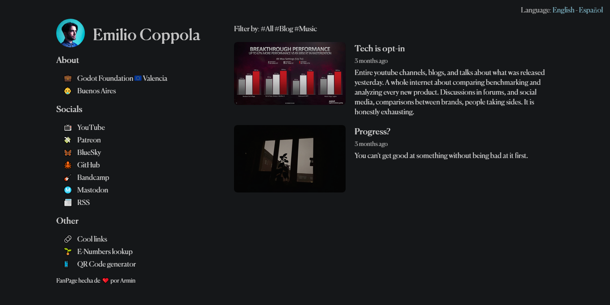
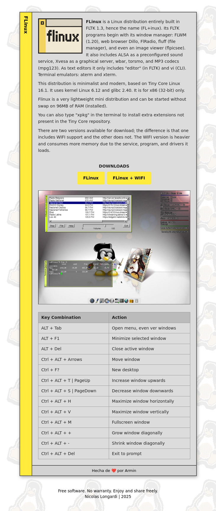
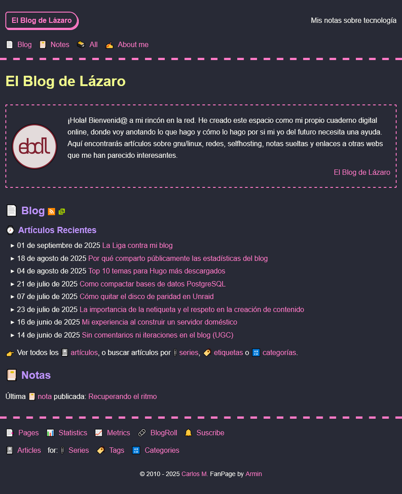

# Plantillas Web
Plantillasweb es una colección de plantillas HTML y CSS creadas desde cero, inspiradas en el diseño visual de sitios web como FLinux, AnimeFLV, El Blog de Lázaro, entre otros. No se trata de copias exactas ni de contenido original, sino de reinterpretaciones visuales y estructurales hechas con fines educativos, técnicos y creativos.

---

## 🚀 Vista previa en línea

👉 [Ver demo en GitHub Pages](https://armindeck.github.io/plantillasweb/)

---

## 📂 Estructura de Archivos

plantillasweb/     
│── [elblogdelazaro/](https://armindeck.github.io/plantillasweb/elblogdelazaro/)  
│── [flinux/](https://armindeck.github.io/plantillasweb/flinux/)  
│── [coppolaemilio/](https://armindeck.github.io/plantillasweb/coppolaemilio/)  
│── README.md    
└── LICENSE

## 📂 Vistas previas

# [Emilio Coppola](https://armindeck.github.io/plantillasweb/coppolaemilio/)

# [FLinux](https://armindeck.github.io/plantillasweb/flinux/)

# [El Blog de Lázaro](https://armindeck.github.io/plantillasweb/elblogdelazaro/)

