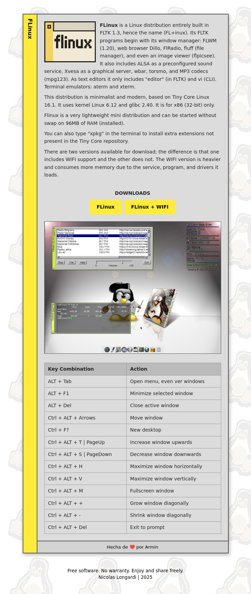

# FLinux

FLinux website es una pagina inpirada en la pagina [FLinux](https://flinux-distro.sourceforge.io/) creada por Nicolas Longardi

## 🚀 Vista previa en línea

👉 [Ver demo en GitHub Pages](https://armindeck.github.io/plantillasweb/flinux/)

---

## 📂 Estructura de Archivos

flinux/     
│── index.html  
│── style.css    
│── README.md  
│── LICENSE  
└── imágenes

## 📂 Vista previa

